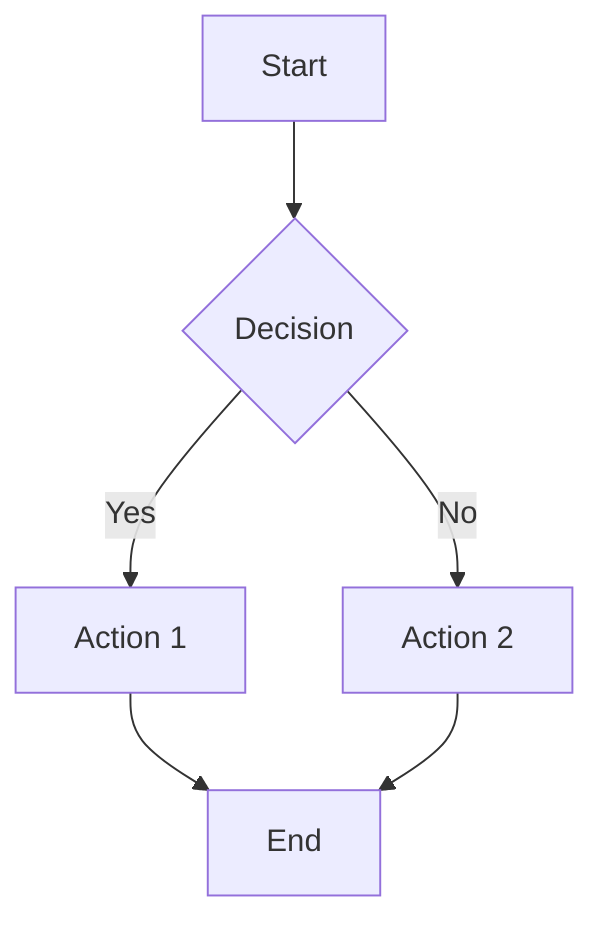
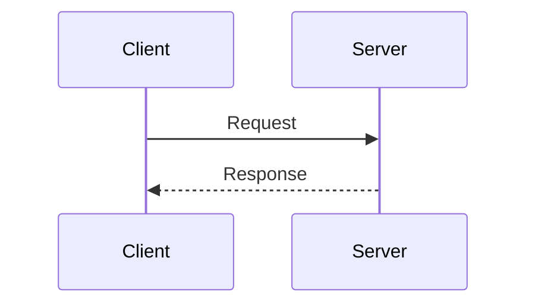

# Footnotes and Extended Syntax

## Footnotes (if supported)

This statement needs a citation[^1].

Another claim with a footnote[^2].

A longer footnote reference[^long-note].

[^1]: This is the first footnote.
[^2]: This is the second footnote.
[^long-note]: This is a longer footnote with multiple paragraphs.

    Subsequent paragraphs are indented to show they belong to the footnote.

    ```python
    # Code can be included in footnotes
    print("Hello from a footnote!")
    ```

## Emoji (if supported)

:smile: :rocket: :thumbsup: :warning: :tada:

## Abbreviations (if supported)

The HTML specification is maintained by the W3C.

*[HTML]: Hypertext Markup Language
*[W3C]: World Wide Web Consortium

## Table of Contents Markers

<!-- toc -->

Some renderers auto-generate a table of contents from this marker.

## Automatic ID Generation for Headings

### This Should Get an ID

Renderers typically generate `id="this-should-get-an-id"` for this heading, allowing anchor links like `#this-should-get-an-id`.

### Duplicate Heading

### Duplicate Heading

Some renderers add suffixes like `-1`, `-2` to duplicate heading IDs.

## Mermaid Diagrams (if supported)




